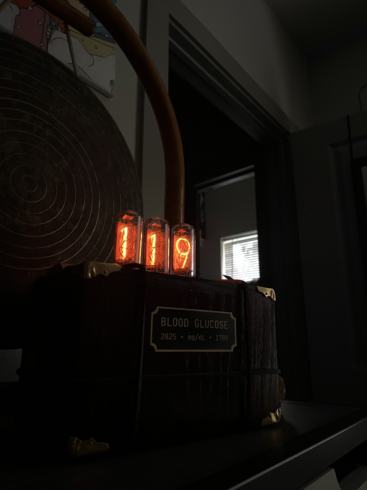
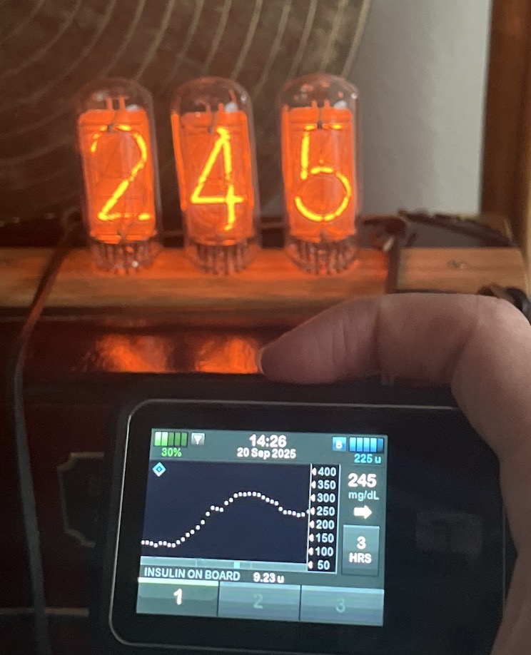
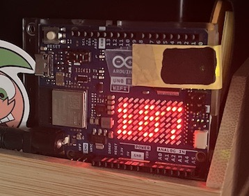
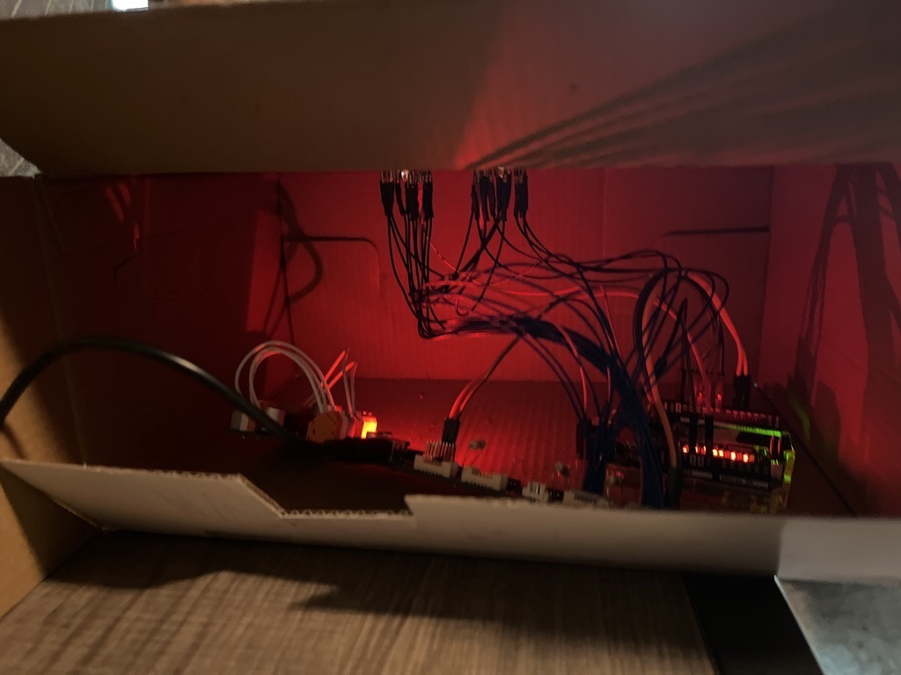
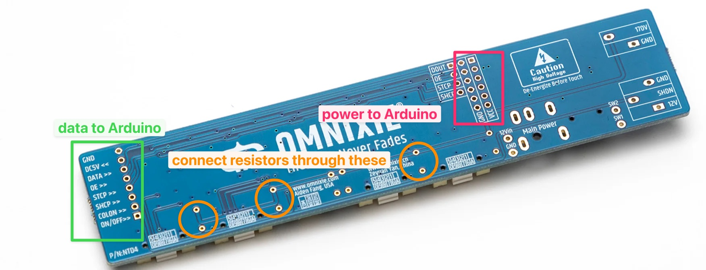

# NixieGlucoseDisplay

Custom Nixie tube display that displays real-time blood sugar data from a continuous glucose monitor





## Server Setup

On your server, ensure `python` is installed and has `pip`. To install the project dependencies, run:

```bash
pip install -r requirements.txt
```

In `dexcom_data_server.py`, populate the line:

```python
dexcom = Dexcom(username="", password="")
```

with your Dexcom username and password, and run with:

```bash
python dexcom_data_server.py
```

This opens by default at port 5000. Opening the server domain + port in your browser should yield something like this:

```plaintext
142
steady
2025-09-12 10:34:46.807000-05:00
```

## Arduino Setup



1. Install the [Arduino IDE](https://www.arduino.cc/en/software/)
2. Install required libraries:
   - ArduinoGraphics
   - Arduino_LED_Matrix
   - R4HttpClient (for Arduino UNO R4 WiFi)
3. Fill out `arduino_secrets.h.template` and rename it to `arduino_secrets.h`
4. Upload the project to your Arduino. If everything went through, it should show a Wi-Fi connection sequence and try to pull from your server. View at 115200 baud when connected to serial to check for debug info

## Hardware Setup



### Components

- [Arduino UNO R4 WiFi](https://store-usa.arduino.cc/products/uno-r4-wifi)
- [Nixie Tube Driver Board for 4 Nixie tubes – Omnixie](https://omnixie.com/products/nixie-tube-driver-board-ntdb-kit-for-4-nixie-tubes)
- [NCH6300HV Nixie HV Power Module DC-DC booster – Omnixie](https://omnixie.com/products/nch6300hv-nixie-hv-power-module)
- 3x [DGM01 Tubes – INIXIE](https://inixielab.com/products/inixie-dgm-tubes)
- [12V 1A DC Power Adapter – Omnixie](https://omnixie.com/products/12v-1a-dc-power-adapter-fc-ul-listed-dc5-5-2-1)
- 3x 9.1kΩ resistors
- 33x 1mm Nixie tube pins
- Handful Male to female jumper wires
- Some normal wire
- A case of some kind

### Setup



- Solder the included headers onto everything
- Solder the resistors to the driver board
- Connect the driver board to your tubes with the pins
- Connect the driver board to the Arduino with the jumper wires:
- Set the DC booster to 170V (use a multimeter)
- Use normal wire to connect the driver board to the DC booster

```plaintext
  NTDB        Arduino Pins
--------------------------------
  GND         GND
  DATA        11
  OE          10
  STCP        8
  SHCP        12
  ON/OFF      6 (HVEnable)
```

- Power the driver board directly with its barrel jack
- You can power the Arduino from the driver board with the vin header, or directly via USB, barrel jack, etc.
- When everything is connected, the tubes should display your blood sugar and fetch your new readings automatically
