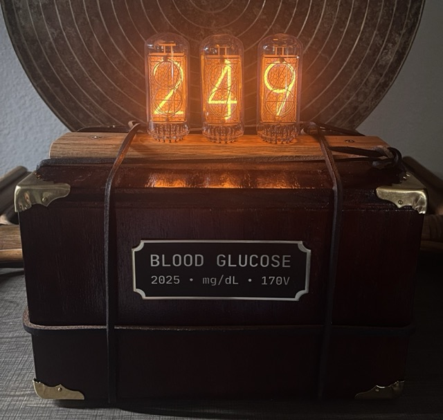

# NixieGlucoseDisplay



This probably isn't replicable anywhere else, but if anyone is curious, I used:

- [Nixie Tube Driver Board for 4 Nixie tubes – Omnixie](https://omnixie.com/products/nixie-tube-driver-board-ntdb-kit-for-4-nixie-tubes)
- [Arduino UNO R4 WiFi](https://store-usa.arduino.cc/products/uno-r4-wifi)
- [DGM01 Tubes – INIXIE](https://inixielab.com/products/inixie-dgm-tubes)

The server I set up is just running [pydexcom](https://github.com/gagebenne/pydexcom) and returns the current reading, trend description, and time of reading:

```
142
steady
2025-09-12 10:34:46.807000-05:00
```
